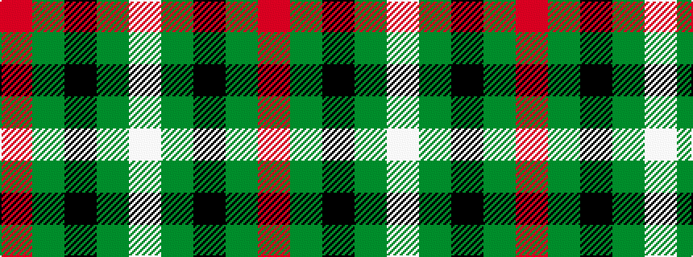

RGKGW

It is a 5 stripe tartan.

<figure class="pat-woven">

<figcaption>idealised sample</figcaption>
</figure>

## Colour Sequence



## Tartans with this colour sequence

| Tartans |
|---------------|
| [Basque (Corporate)](/variants/s5/r44g6k3g16w22/)|
||
| [Inverness Basque](/variants/s5/r22dg6k3dg16w22/)|
||
| [Inverness Basque (District)](/variants/s5/r33g9k5g24w33~x2/)|
||
