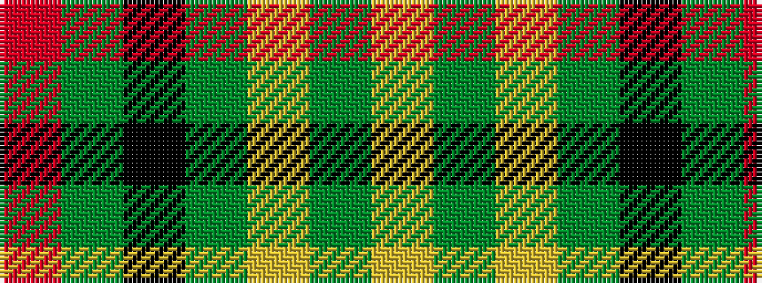

RGKGYGY

It is a 7 stripe tartan.

<figure class="pat-woven">

<figcaption>idealised sample</figcaption>
</figure>

## Colour Sequence



## Tartans with this colour sequence

| Tartans |
|---------------|
| [Paton](/setts/s7/r3g24k28g19ly3g3ly3~x2/)|
||
| [Paton (Personal)](/setts/s7/r3g20k20g20lo2g2lo2~x2/)|
||
