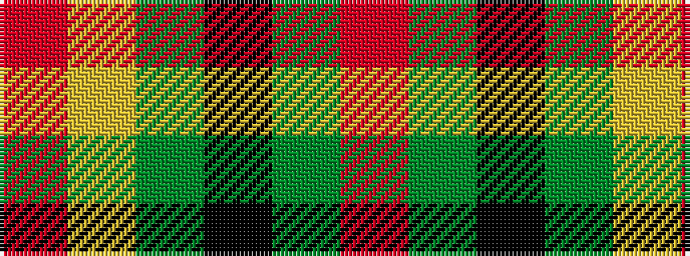

RGKGYR

It is a 6 stripe tartan.

<figure class="pat-woven">

<figcaption>idealised sample</figcaption>
</figure>

## Colour Sequence



## Tartans with this colour sequence

| Tartans |
|---------------|
| [Shawn Jones Afghan Memorial, The](/setts/s6/r12g4k8dy3ly62r8~x2/)|
||
