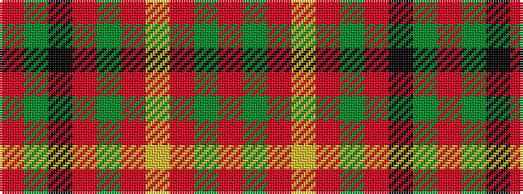

RGKRGRYRGR

It is a 10 stripe tartan.

<figure class="pat-woven">

<figcaption>idealised sample</figcaption>
</figure>

## Colour Sequence



## Tartans with this colour sequence

| Tartans |
|---------------|
| [Annan](/variants/s10/o15y1o2lo2o2y1o3k8y10o3~x4/)|
||
