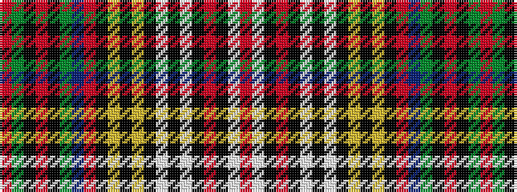

RGKRKGBRKYKYKWKWKRKWR

It is a 21 stripe tartan.

<figure class="pat-woven">

<figcaption>idealised sample</figcaption>
</figure>

## Colour Sequence



## Tartans with this colour sequence

| Tartans |
|---------------|
| [Anderson P](/setts/s21/r3dg6k1r2k1dg6db5r1k3ly1k1ly1k3lb3k3lb18k1r2k1lb6r3/)|
||
