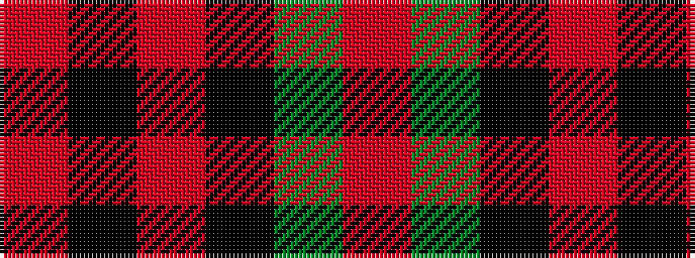

RGKRKR

It is a 6 stripe tartan.

<figure class="pat-woven">

<figcaption>idealised sample</figcaption>
</figure>

## Colour Sequence



## Tartans with this colour sequence

| Tartans |
|---------------|
| [Dunbar](/setts/s6/r6g21k8r28k2r4~x2/)|
||
| [Dunbar](/setts/s6/r6g21k8r28k1r4~x2/)|
||
| [Dunbar](/setts/s6/r6dg21k8r28k1r4~x2/)|
||
