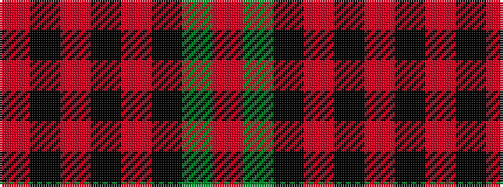

RGKRKRKR

It is a 8 stripe tartan.

<figure class="pat-woven">

<figcaption>idealised sample</figcaption>
</figure>

## Colour Sequence



## Tartans with this colour sequence

| Tartans |
|---------------|
| [Booth (Fashion)](/setts/s8/r2dy14k26ri3k2ri12k1ri2~x4/)|
||
