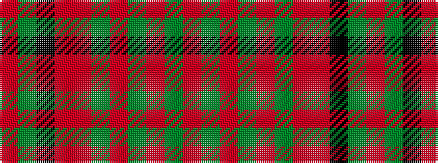

RGKRRGRGRGR

It is a 11 stripe tartan.

<figure class="pat-woven">

<figcaption>idealised sample</figcaption>
</figure>

## Colour Sequence



## Tartans with this colour sequence

| Tartans |
|---------------|
| [MacDougal 3](/setts/s11/r4g8k6r8r6g2r2g2r24g1r3~x2/)|
||
| [MacDougall #8](/setts/s11/r4dg8k6r8r6dg2r2dg2r24dg1r3~x2/)|
||
