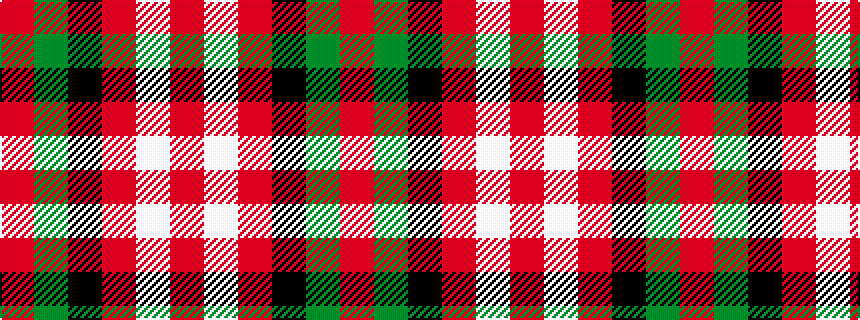

RGKRWR

It is a 6 stripe tartan.

<figure class="pat-woven">

<figcaption>idealised sample</figcaption>
</figure>

## Colour Sequence



## Tartans with this colour sequence

| Tartans |
|---------------|
| [MacKintosh #4](/variants/s6/r5w2r28k12dg16r3~x2/)|
||
| [MacKintosh 6](/variants/s6/r5w2r28k12g16r3~x2/)|
||
| [Nisbet](/variants/s6/r10g24k10r28lb3r6~x2/)|
||
