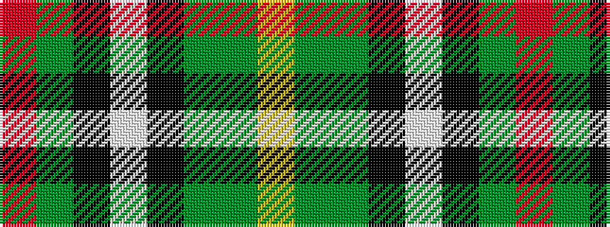

RGKWKGGY

It is a 8 stripe tartan.

<figure class="pat-woven">

<figcaption>idealised sample</figcaption>
</figure>

## Colour Sequence



## Tartans with this colour sequence

| Tartans |
|---------------|
| [Lawson, William](/setts/s8/r3dgi1k16w3k15dg13dgi22lo3~x2/)|
||
