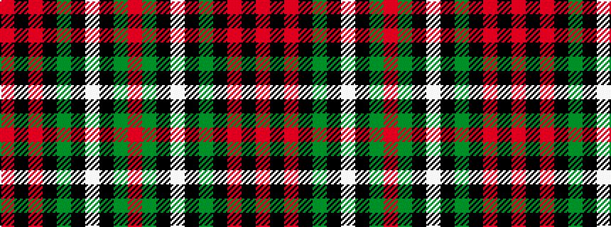

RGKWKGKRKR

It is a 10 stripe tartan.

<figure class="pat-woven">

<figcaption>idealised sample</figcaption>
</figure>

## Colour Sequence



## Tartans with this colour sequence

| Tartans |
|---------------|
| [MacDiarmid](/variants/s10/r3k6r3k6g6k1w1k1g6r1~x2/)|
||
| [MacDiarmid #3](/variants/s10/r3k6r3k6dg6k1w1k1dg6r1~x2/)|
||
