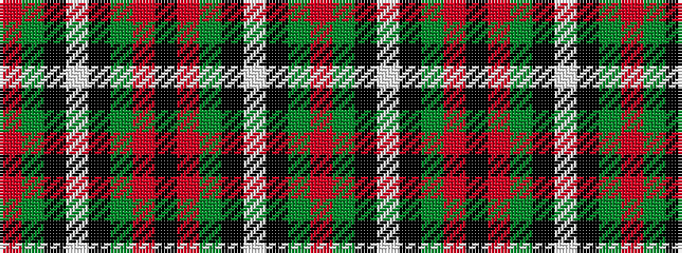

RGKWKGRKRGKWKGR

It is a 15 stripe tartan.

<figure class="pat-woven">

<figcaption>idealised sample</figcaption>
</figure>

## Colour Sequence



## Tartans with this colour sequence

| Tartans |
|---------------|
| [MacDiarmid](/setts/s15/r5g56k2w5k2g56r16k83r16g56k2w5k2g56r5~x2/)|
||
