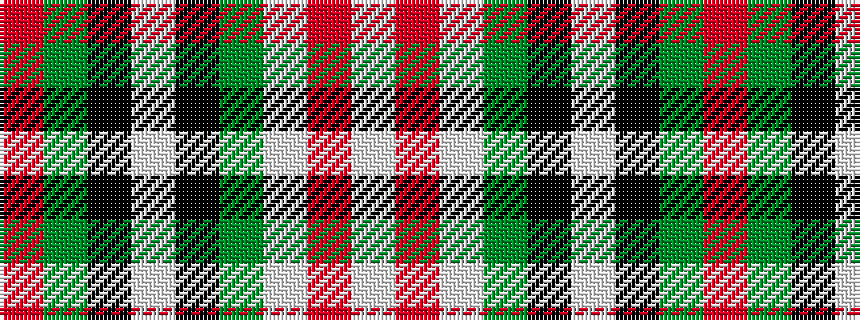

RGKWKGWRW

It is a 9 stripe tartan.

<figure class="pat-woven">

<figcaption>idealised sample</figcaption>
</figure>

## Colour Sequence



## Tartans with this colour sequence

| Tartans |
|---------------|
| [MacDiarmid Dress](/setts/s9/w38r12w37g32k3w4k3g32r4~x2/)|
||
| [MacDiarmid, dress](/setts/s9/w38r12w37g32k3w4k3g32r4/)|
||
