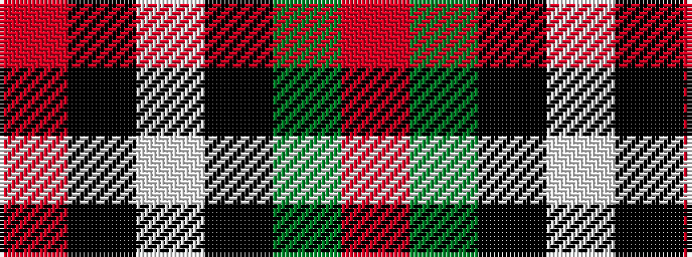

RGKWKR

It is a 6 stripe tartan.

<figure class="pat-woven">

<figcaption>idealised sample</figcaption>
</figure>

## Colour Sequence



## Tartans with this colour sequence

| Tartans |
|---------------|
| [Thom(p)son, Grey](/setts/s6/r2y20k5w10k10r2~x2/)|
||
