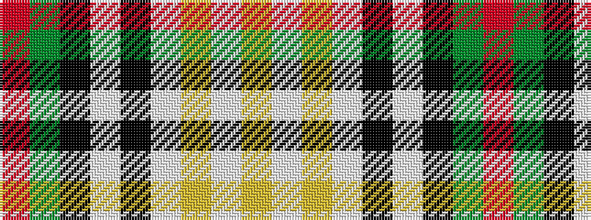

RGKWKWYWY

It is a 9 stripe tartan.

<figure class="pat-woven">

<figcaption>idealised sample</figcaption>
</figure>

## Colour Sequence



## Tartans with this colour sequence

| Tartans |
|---------------|
| [Bell Family Tartan](/variants/s9/r3g2k9lb2k2lb24ly2lb2ly1~x2/)|
||
