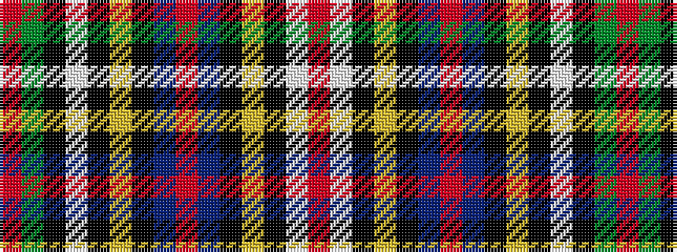

RGKWKYKBRBKYKWR

It is a 15 stripe tartan.

<figure class="pat-woven">

<figcaption>idealised sample</figcaption>
</figure>

## Colour Sequence



## Tartans with this colour sequence

| Tartans |
|---------------|
| [Wilson's, No 17](/variants/s15/r44g25k2w6k2ly3k16t12r6t12k16ly3k2w6r44~x2/)|
||
