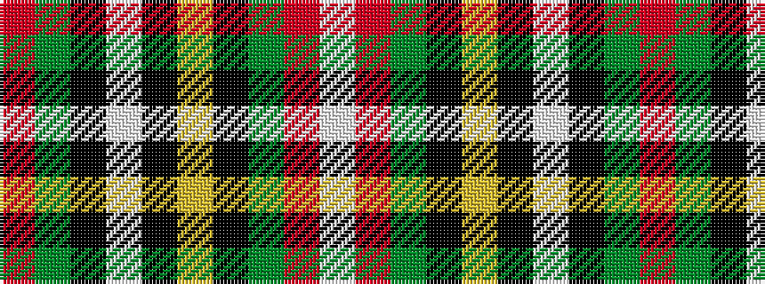

RGKWKYKGRW

It is a 10 stripe tartan.

<figure class="pat-woven">

<figcaption>idealised sample</figcaption>
</figure>

## Colour Sequence



## Tartans with this colour sequence

| Tartans |
|---------------|
| [Bruce of Kinnaird](/setts/s10/r24g22k2w6k2ly2k15y6r6w2~x2/)|
||
