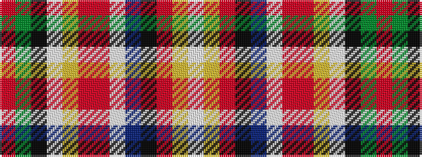

RGKWYRRWBKRYW

It is a 13 stripe tartan.

<figure class="pat-woven">

<figcaption>idealised sample</figcaption>
</figure>

## Colour Sequence



## Tartans with this colour sequence

| Tartans |
|---------------|
| [MacGill](/setts/s13/r48g16k8w3ly3r2o3w3db8k1r4ly4w3~x2/)|
||
