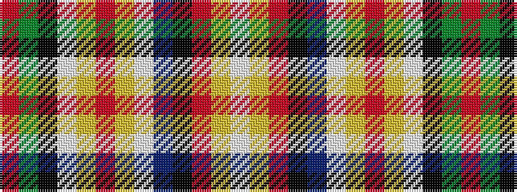

RGKWYRYWBKRYW

It is a 13 stripe tartan.

<figure class="pat-woven">

<figcaption>idealised sample</figcaption>
</figure>

## Colour Sequence



## Tartans with this colour sequence

| Tartans |
|---------------|
| [MacGill](/setts/s13/r28g10k7w2ly2r1ly2w2db5k2r2ly2w3~x4/)|
||
| [MacGill](/setts/s13/r41dg13k8lb2ly2r1ly2lb2db6k2r3ly2lb5/)|
||
| [MacGill Clan Tartan Tartan Number: 1487. Earliest known date: pre 1745 This sample comes from the MacGregor-Hastie collection which forms the basis of the cloth archive of the Scottish Tartans Society. One can assume that the sample dates between 1930 and 1950. The family tartan, which originated with the MacGills of Jura, was in use before 1745 but when tartan was proscribed the sett seemed to have been lost until a piece was discovered in Kintyre. It is now in the Museum of Antiquities, Edinburgh. The current version, which first appeared in 1930, is known as the MacGill Society tartan. See products available Copyright © Blair Urquhart, Comrie, 2015](/setts/s13/r47g16k8w3ly3r2ly3w3db6k3r4ly4w3~x2/)|
|![MacGill Clan Tartan Tartan Number: 1487. Earliest known date: pre 1745 This sample comes from the MacGregor-Hastie collection which forms the basis of the cloth archive of the Scottish Tartans Society. One can assume that the sample dates between 1930 and 1950. The family tartan, which originated with the MacGills of Jura, was in use before 1745 but when tartan was proscribed the sett seemed to have been lost until a piece was discovered in Kintyre. It is now in the Museum of Antiquities, Edinburgh. The current version, which first appeared in 1930, is known as the MacGill Society tartan. See products available Copyright © Blair Urquhart, Comrie, 2015 example sett](/setts/s13/r47g16k8w3ly3r2ly3w3db6k3r4ly4w3~x2/sett.png)|
