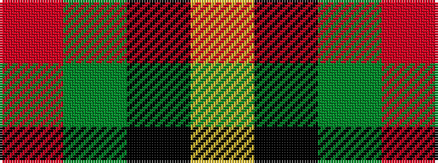

RGKY

It is a 4 stripe tartan.

<figure class="pat-woven">

<figcaption>idealised sample</figcaption>
</figure>

## Colour Sequence



## Tartans with this colour sequence

| Tartans |
|---------------|
| [Brooks Brothers (Corporate)](/variants/s4/r1g11k11lo1~x4/)|
||
