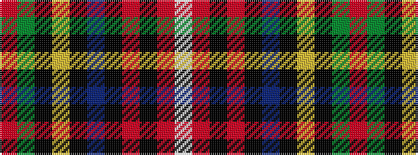

RGKYKBKRKRW

It is a 11 stripe tartan.

<figure class="pat-woven">

<figcaption>idealised sample</figcaption>
</figure>

## Colour Sequence



## Tartans with this colour sequence

| Tartans |
|---------------|
| [King George VI](/setts/s11/r3dg24k4ly2k3db2k6r4k2r3w2~x2/)|
||
| [King George VI](/setts/s11/r3g24k4ly2k3db2k6r4k2r3w2~x2/)|
||
