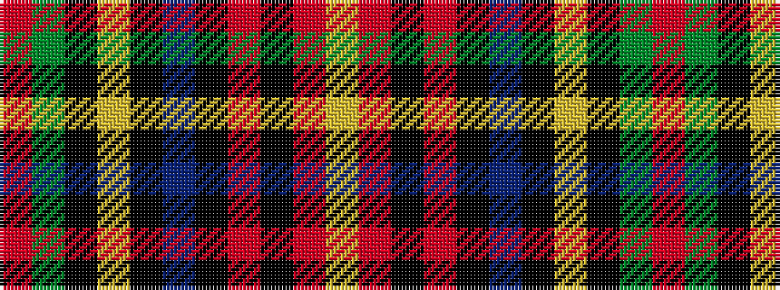

RGKYKBKRKRY

It is a 11 stripe tartan.

<figure class="pat-woven">

<figcaption>idealised sample</figcaption>
</figure>

## Colour Sequence



## Tartans with this colour sequence

| Tartans |
|---------------|
| [King George (Nash)](/variants/s11/r5dg30k6ly2k3b5k12r8k3r3lr3~x2/)|
||
