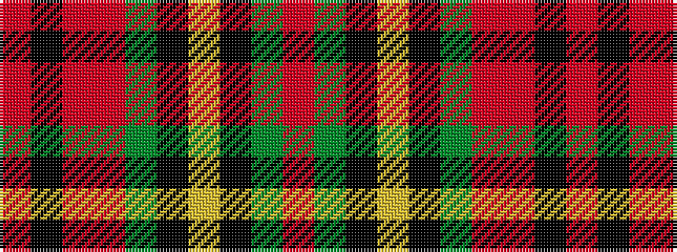

RGKYKGRRKR

It is a 10 stripe tartan.

<figure class="pat-woven">

<figcaption>idealised sample</figcaption>
</figure>

## Colour Sequence



## Tartans with this colour sequence

| Tartans |
|---------------|
| [MacAart](/setts/s10/o9k2o2r2g6k1ly1k1g6r3~x2/)|
||
