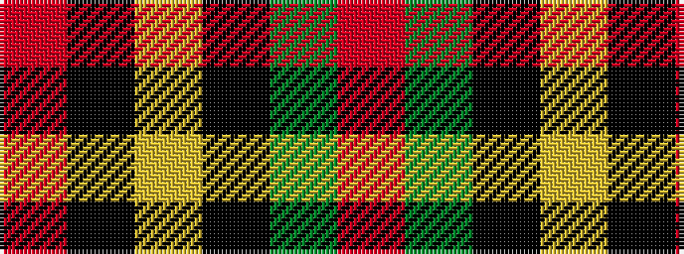

RGKYKR

It is a 6 stripe tartan.

<figure class="pat-woven">

<figcaption>idealised sample</figcaption>
</figure>

## Colour Sequence



## Tartans with this colour sequence

| Tartans |
|---------------|
| [Thompson/Thomson/MacTavish special grey](/variants/s6/r3y27k6lo13k14r3~x2/)|
||
