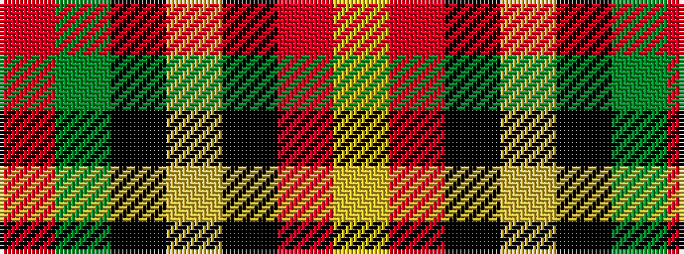

RGKYKRY

It is a 7 stripe tartan.

<figure class="pat-woven">

<figcaption>idealised sample</figcaption>
</figure>

## Colour Sequence



## Tartans with this colour sequence

| Tartans |
|---------------|
| [Duffus Hose, Lord](/setts/s7/lo11m6k10lo10k10dy10m4~x2/)|
||
| [Duffus Lord... Portrait Tartan Tartan Number: 1661. Earliest known date: 1705 The hose in the portrait of Lord Duffus (1705). Reconstructed and woven by Scottish Tartans Society. See products available Copyright © Blair Urquhart, Comrie, 2015](/setts/s7/ly15r7k12ly12k12dy12r7~x2/)|
||
