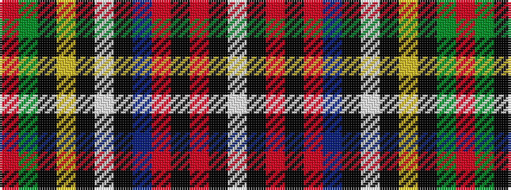

RGKYKWKBRKRKW

It is a 13 stripe tartan.

<figure class="pat-woven">

<figcaption>idealised sample</figcaption>
</figure>

## Colour Sequence



## Tartans with this colour sequence

| Tartans |
|---------------|
| [Galt, Sir Alexander..](/variants/s13/r4g22k16ly2k3w3k2db20r8k2r4k1w2~x2/)|
||
| [Louise of Lorne #2](/variants/s13/r4dg22k16ly2k3w3k2db20r8k2r4k1w2~x2/)|
||
| [Tilley, Sir Samuel Leonard](/variants/s13/r4dg20k16ly2k3lb3k2n18r6k2r4k1lb2~x4/)|
||
