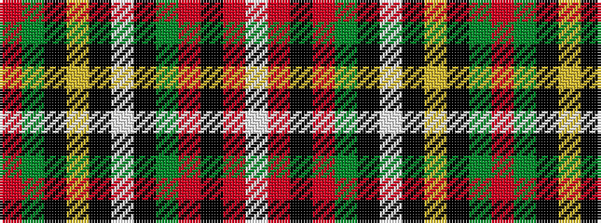

RGKYKWKGRKRW

It is a 12 stripe tartan.

<figure class="pat-woven">

<figcaption>idealised sample</figcaption>
</figure>

## Colour Sequence



## Tartans with this colour sequence

| Tartans |
|---------------|
| [Royal Stewart](/setts/s12/r18gi2k3ly1k1w1k1g4r2k1r1w1~x4/)|
||
