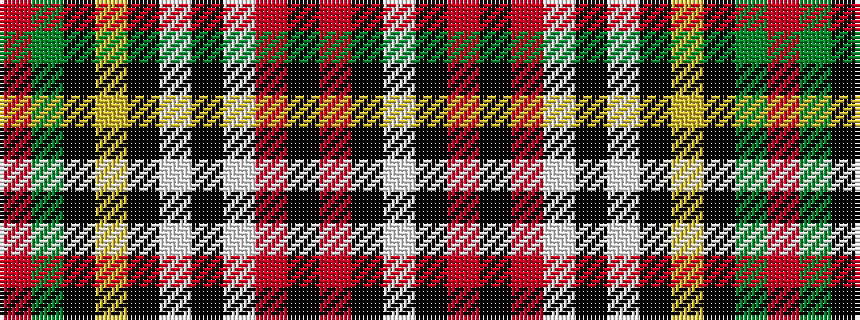

RGKYKWKWRKRKW

It is a 13 stripe tartan.

<figure class="pat-woven">

<figcaption>idealised sample</figcaption>
</figure>

## Colour Sequence



## Tartans with this colour sequence

| Tartans |
|---------------|
| [Palmer, Edward](/setts/s13/r4dg20k16ly2k3w3k2w18r6k2r4k1w2~x2/)|
||
