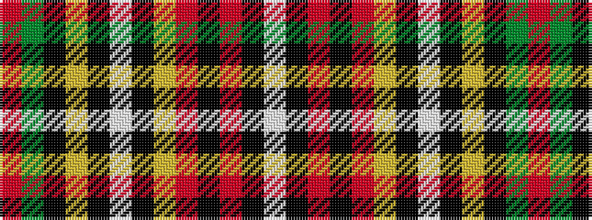

RGKYKWKYRKRKW

It is a 13 stripe tartan.

<figure class="pat-woven">

<figcaption>idealised sample</figcaption>
</figure>

## Colour Sequence



## Tartans with this colour sequence

| Tartans |
|---------------|
| [Johnson, J.M.](/setts/s13/r4dg20k16lo2k3w3k2lo18r6k2r4k1w2~x4/)|
||
