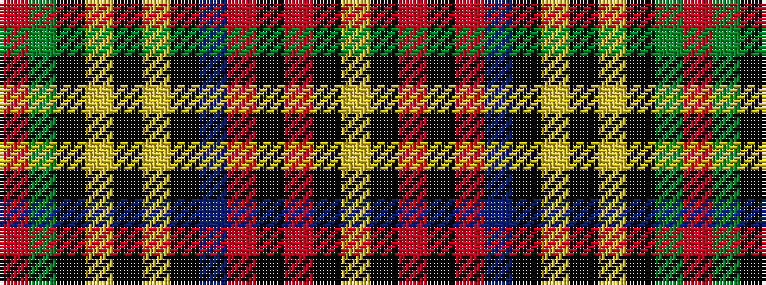

RGKYKYKBRKRKY

It is a 13 stripe tartan.

<figure class="pat-woven">

<figcaption>idealised sample</figcaption>
</figure>

## Colour Sequence



## Tartans with this colour sequence

| Tartans |
|---------------|
| [Galt, Alexander, Sir](/setts/s13/r4dg20k16ly2k3lr3k2db18r6k2r4k1lr2~x4/)|
||
