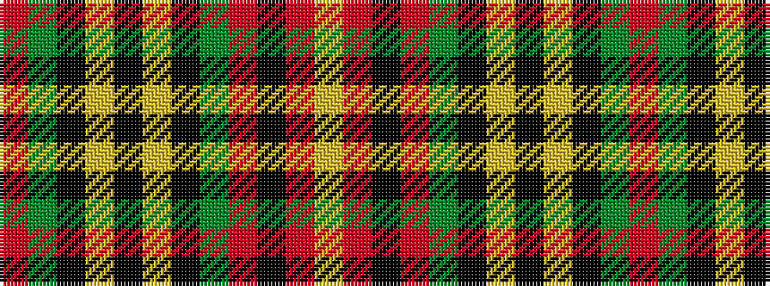

RGKYKYKGRKRY

It is a 12 stripe tartan.

<figure class="pat-woven">

<figcaption>idealised sample</figcaption>
</figure>

## Colour Sequence



## Tartans with this colour sequence

| Tartans |
|---------------|
| [Unidentified #53](/setts/s12/r16dg4k3ly1k2lr1k3dg4r4k1r4lr1~x4/)|
||
