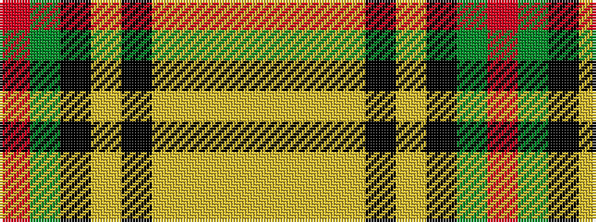

RGKYKYYYY

It is a 9 stripe tartan.

<figure class="pat-woven">

<figcaption>idealised sample</figcaption>
</figure>

## Colour Sequence



## Tartans with this colour sequence

| Tartans |
|---------------|
| [Bell of the Borders](/variants/s9/r3g2k9lr2k2lr24ly2lr2ly1~x4/)|
||
