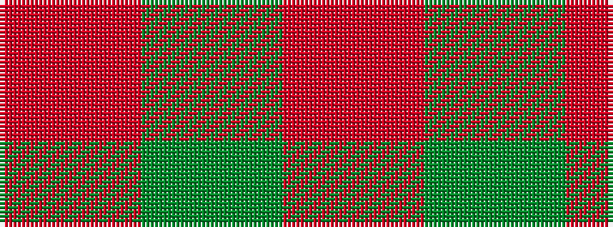

RGR

It is a 3 stripe tartan.

<figure class="pat-woven">

<figcaption>idealised sample</figcaption>
</figure>

## Colour Sequence



## Tartans with this colour sequence

| Tartans |
|---------------|
| [Moncreiffe D](/setts/r1dg1r1/)|
||
| [Outlander #5](/variants/s3/o13dy15o2~x4/)|
||
