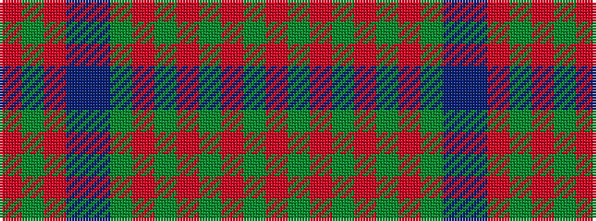

RGRBBGRGRGRGR

It is a 13 stripe tartan.

<figure class="pat-woven">

<figcaption>idealised sample</figcaption>
</figure>

## Colour Sequence



## Tartans with this colour sequence

| Tartans |
|---------------|
| [Matheson](/variants/s13/r2g2r12db10t3g10r2g2r2g10r12g2r2~x2/)|
||
| [Matheson (Logan 1831)](/variants/s13/r2dg2r12dg10r2dg2r2dg10t3db10r12dg2r2~x2/)|
||
| [Matheson N](/setts/r2dg2r12dg10r2dg2r2dg10b3db10r12dg2r2/)|
||
