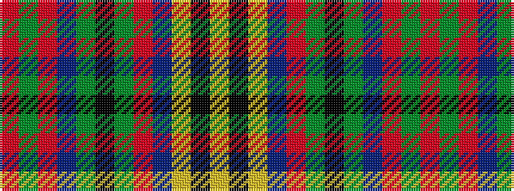

RGRBGKGRBYKY

It is a 12 stripe tartan.

<figure class="pat-woven">

<figcaption>idealised sample</figcaption>
</figure>

## Colour Sequence



## Tartans with this colour sequence

| Tartans |
|---------------|
| [Westgaard Htg (Personal)](/setts/s12/r9dg4r6db4dg2k2dg2r5db3ly2k2ly2~x2/)|
||
