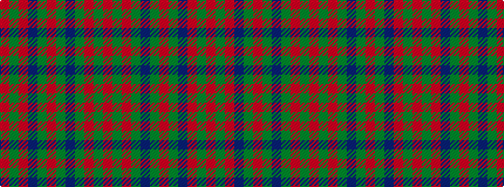

RGRBGRGBGRGR

It is a 12 stripe tartan.

<figure class="pat-woven">

<figcaption>idealised sample</figcaption>
</figure>

## Colour Sequence



## Tartans with this colour sequence

| Tartans |
|---------------|
| [Frasers Highlanders (Military?)](/variants/s12/r28g2r2g2db12g18r2g18db12r15g2r3~x2/)|
||
