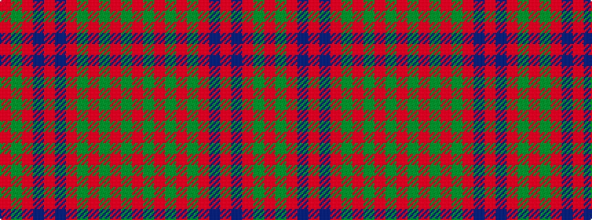

RGRBRBRGRGRGR

It is a 13 stripe tartan.

<figure class="pat-woven">

<figcaption>idealised sample</figcaption>
</figure>

## Colour Sequence



## Tartans with this colour sequence

| Tartans |
|---------------|
| [Grant of Monymusk](/setts/r12dg14r4dg14r4dg14r4db8r5db8r12dg3r12/)|
||
| [Grant of Monymusk](/variants/s13/r12g14r4g14r4g14r4db8r5db8r12g3r12~x2/)|
||
