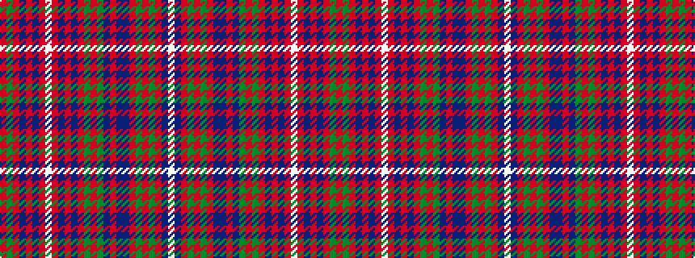

RGRBRBRWRBRBRGRGBRBBRGRGRBW

It is a 27 stripe tartan.

<figure class="pat-woven">

<figcaption>idealised sample</figcaption>
</figure>

## Colour Sequence



## Tartans with this colour sequence

This pattern is a design lineage: every tartan below shares one colour order, whatever its owner —
near-identical designs are grouped, the largest lineage first (#112: the pattern is a tartan's
second parent, beside its family or clan).

<table class="sett-table">
<tbody>
<tr><td><a href="/variants/s27/r5g10r2db2r30dp3r2w1r2dp3r30db2r2g10r10g10dp4r2dp4db10r4g2r4g30r2dp3w1~x2/">MacDougall Clan Tartan</a></td></tr>
<tr><td class="sett-swatch"></td></tr>
<tr class="cluster-sep"><td></td></tr>
<tr><td><a href="/variants/s27/r5g10r2db2r30dr3r2w1r2dr3r30db2r2g10r10g10dr4r2dr4db10r4g2r4g30r2dr3w1~x2/">MacDougall D</a></td></tr>
<tr><td class="sett-swatch"></td></tr>
</tbody>
</table>

