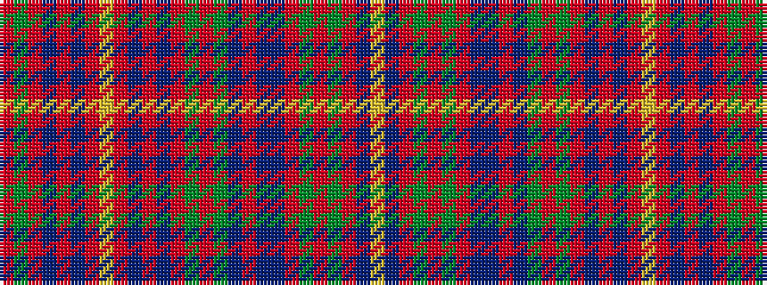

RGRBRBRYRBRBRGRGBRBBRGRGRBY

It is a 27 stripe tartan.

<figure class="pat-woven">

<figcaption>idealised sample</figcaption>
</figure>

## Colour Sequence



## Tartans with this colour sequence

| Tartans |
|---------------|
| [MacDougall D](/variants/s27/r5dg10r2db2r30n3r2lr1r2n3r30db2r2dg10r10dg10n4r2n4db10r4dg2r4dg30r2n3lr1~x2/)|
||
