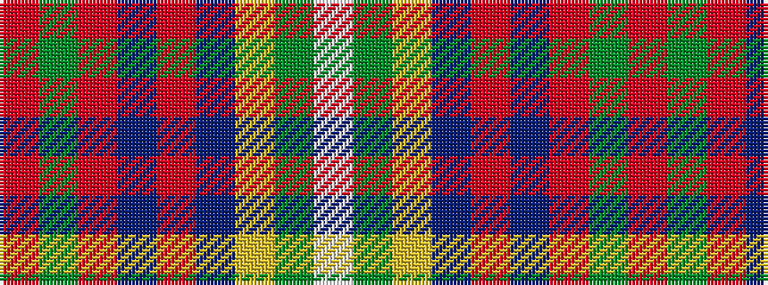

RGRBRBYGW

It is a 9 stripe tartan.

<figure class="pat-woven">

<figcaption>idealised sample</figcaption>
</figure>

## Colour Sequence



## Tartans with this colour sequence

| Tartans |
|---------------|
| [Inchforth (Personal)](/setts/s9/o4g2o7dt30o8dt7lg5g1w2~x2/)|
||
