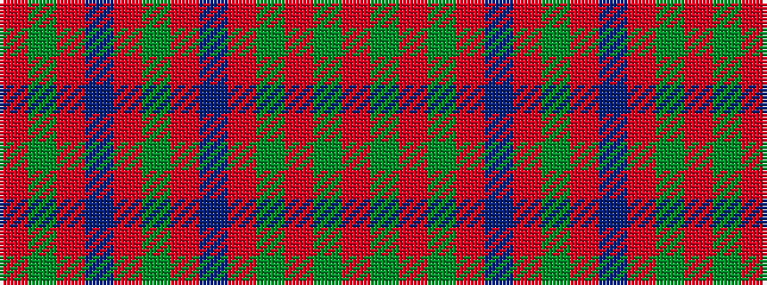

RGRBRGRBRGRGR

It is a 13 stripe tartan.

<figure class="pat-woven">

<figcaption>idealised sample</figcaption>
</figure>

## Colour Sequence



## Tartans with this colour sequence

| Tartans |
|---------------|
| [Robertson](/tartans/r1dg1r9dg1r1db9r1dg9r1db1r9dg1r1/)|
||
| [Robertson 3](/setts/s13/r1g1r9db1r1g9r1db9r1g1r9g1r1~x4/)|
||
