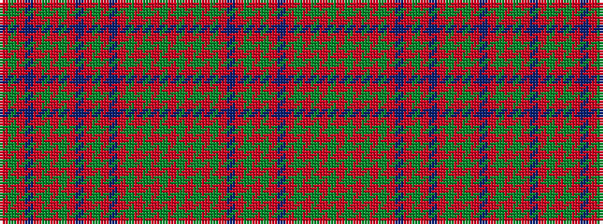

RGRBRGRGRBRGRBRGRGRGRGRGRGRBRGR

It is a 31 stripe tartan.

<figure class="pat-woven">

<figcaption>idealised sample</figcaption>
</figure>

## Colour Sequence



## Tartans with this colour sequence

| Tartans |
|---------------|
| [Robertson](/setts/s31/r1g17r2db2r17g2r2g2r17db2r2g17r2db17r2g2r17g2r2g2r17g2r2g17r2g17r2db2r17g2r1~x4/)|
||
