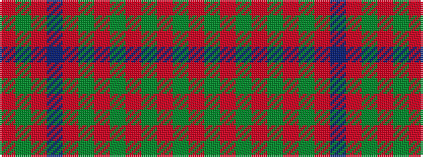

RGRBRGRGRGRGR

It is a 13 stripe tartan.

<figure class="pat-woven">

<figcaption>idealised sample</figcaption>
</figure>

## Colour Sequence



## Tartans with this colour sequence

| Tartans |
|---------------|
| [Grant of Rothiemurchus](/setts/s13/r1g1r32db32r8g1r1g1r8g32r32g1r1~x2/)|
||
| [Unnamed 18th century plaid from Rothiemurchus](/setts/s13/r1g1r32dp32r8g1r1g1r8g32r32g1r1~x2/)|
||
