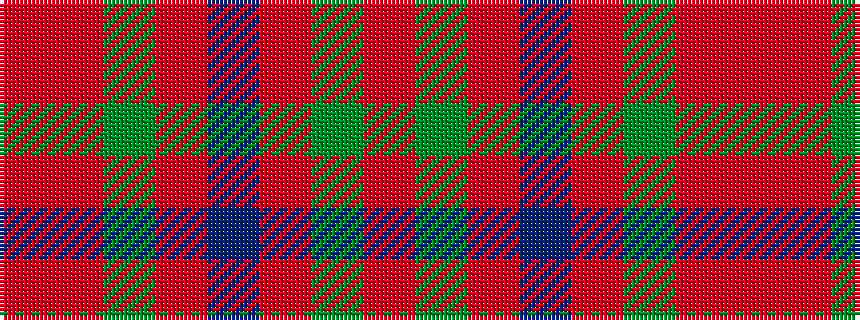

RGRBRGRR

It is a 8 stripe tartan.

<figure class="pat-woven">

<figcaption>idealised sample</figcaption>
</figure>

## Colour Sequence



## Tartans with this colour sequence

| Tartans |
|---------------|
| [Invertere, (Daks)](/variants/s8/r5dg12o4db4o22dg3o4r5/)|
||
