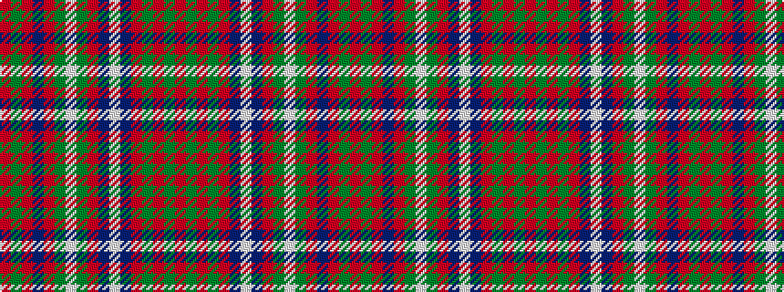

RGRBRGWGRBWBRGRGR

It is a 17 stripe tartan.

<figure class="pat-woven">

<figcaption>idealised sample</figcaption>
</figure>

## Colour Sequence



## Tartans with this colour sequence

| Tartans |
|---------------|
| [Reid Red Clan/Family Tartan](/variants/s17/r3g3r18g6r4db3lb3db18r6g18lb3g3r3db4r18g3r3~x2/)|
||
| [Reid of Straloch (Personal)](/variants/s17/o3g3o18g6o4b3w3b18o6g18w3g3o4b6o18g3o3~x2/)|
||
| [Reid of Straloch (Personal)](/variants/s17/r1g1r6db2r1g1w1g6r2db6w1db1r1g2r6g1r1~x6/)|
||
