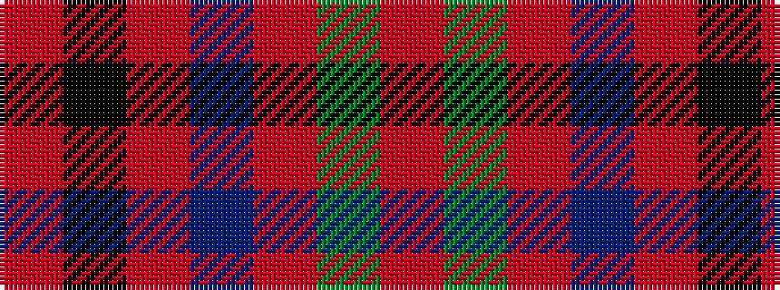

RGRBRKR

It is a 7 stripe tartan.

<figure class="pat-woven">

<figcaption>idealised sample</figcaption>
</figure>

## Colour Sequence



## Tartans with this colour sequence

| Tartans |
|---------------|
| [Buccleuch](/setts/s7/r107k9r5dp41r5g51r14/)|
||
| [Buccleuch](/setts/s7/r107k9r5db41r5g51r14/)|
||
