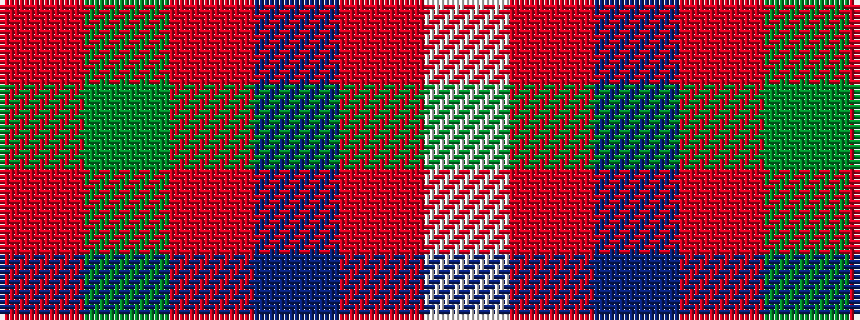

RGRBRW

It is a 6 stripe tartan.

<figure class="pat-woven">

<figcaption>idealised sample</figcaption>
</figure>

## Colour Sequence



## Tartans with this colour sequence

| Tartans |
|---------------|
| [Howard, Vincent (Personal)](/setts/s6/r65dg16r4dp4r4w5~x2/)|
||
| [Howard, Vincent (Personal)](/setts/s6/r65g16r4dp4r4w5~x2/)|
||
