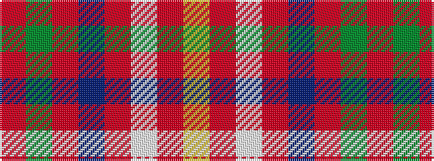

RGRBRWRY

It is a 8 stripe tartan.

<figure class="pat-woven">

<figcaption>idealised sample</figcaption>
</figure>

## Colour Sequence



## Tartans with this colour sequence

| Tartans |
|---------------|
| [Loch Lochy](/setts/s8/r6dg14r6db11r31lb2r4ly3~x2/)|
||
| [Loch Lochy (District)](/setts/s8/r6g14r6db12r31lb2r4ly3~x2/)|
||
