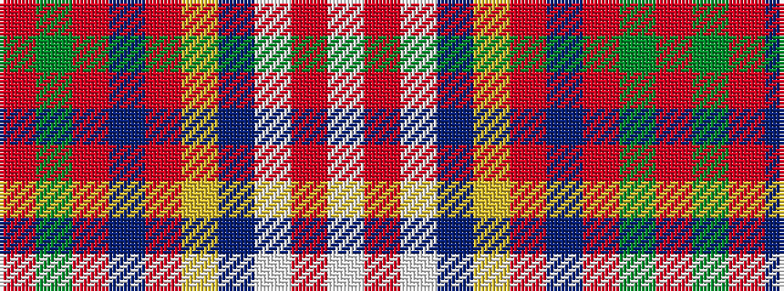

RGRBRYBWRW

It is a 10 stripe tartan.

<figure class="pat-woven">

<figcaption>idealised sample</figcaption>
</figure>

## Colour Sequence



## Tartans with this colour sequence

| Tartans |
|---------------|
| [Swiss Country](/setts/s10/r108g3r2db2r2ly2n5w2r6w6~x2/)|
||
