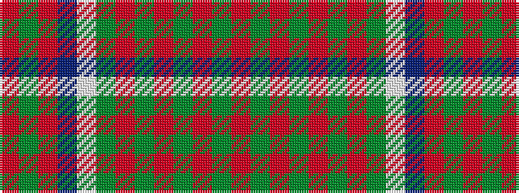

RGRBWGRGRGRGR

It is a 13 stripe tartan.

<figure class="pat-woven">

<figcaption>idealised sample</figcaption>
</figure>

## Colour Sequence



## Tartans with this colour sequence

| Tartans |
|---------------|
| [Matheson N](/setts/s13/r2dg2r12dg10r2dg2r2dg10lb3db10r12dg2r2/)|
||
